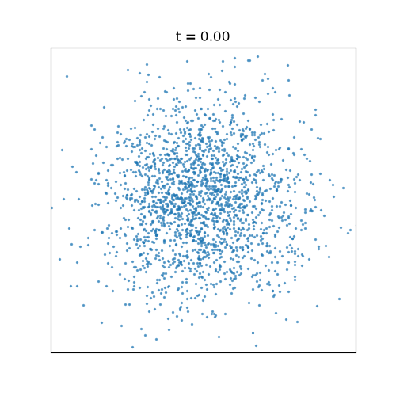
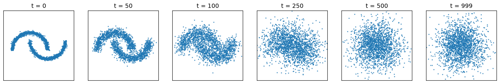
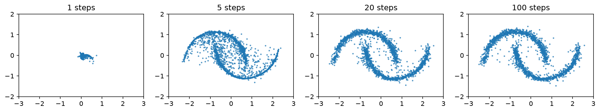
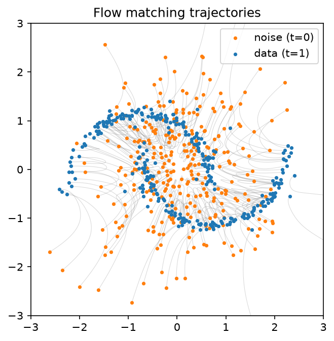
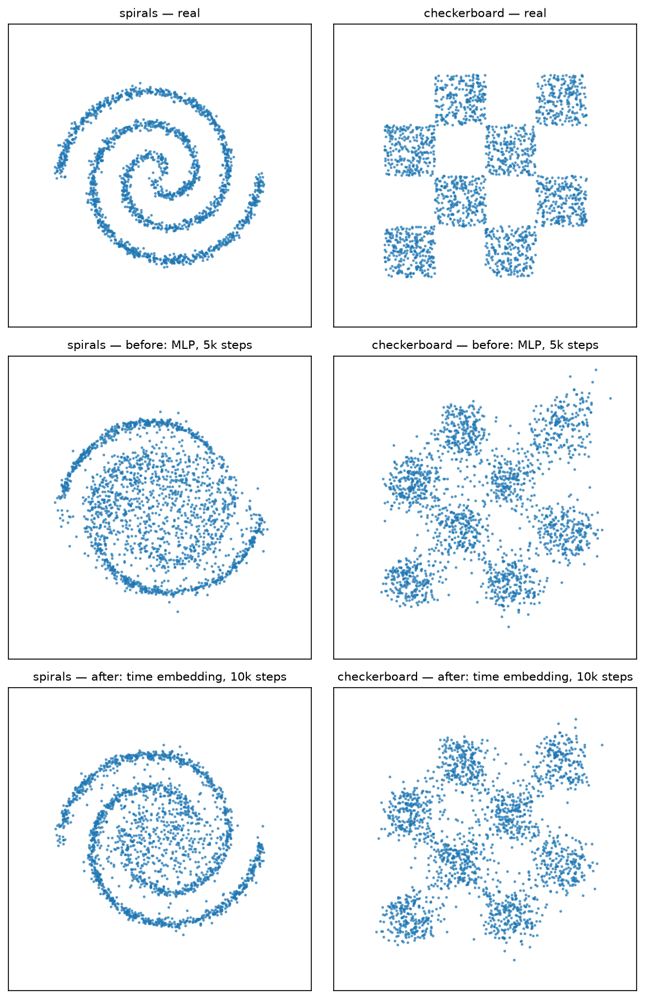
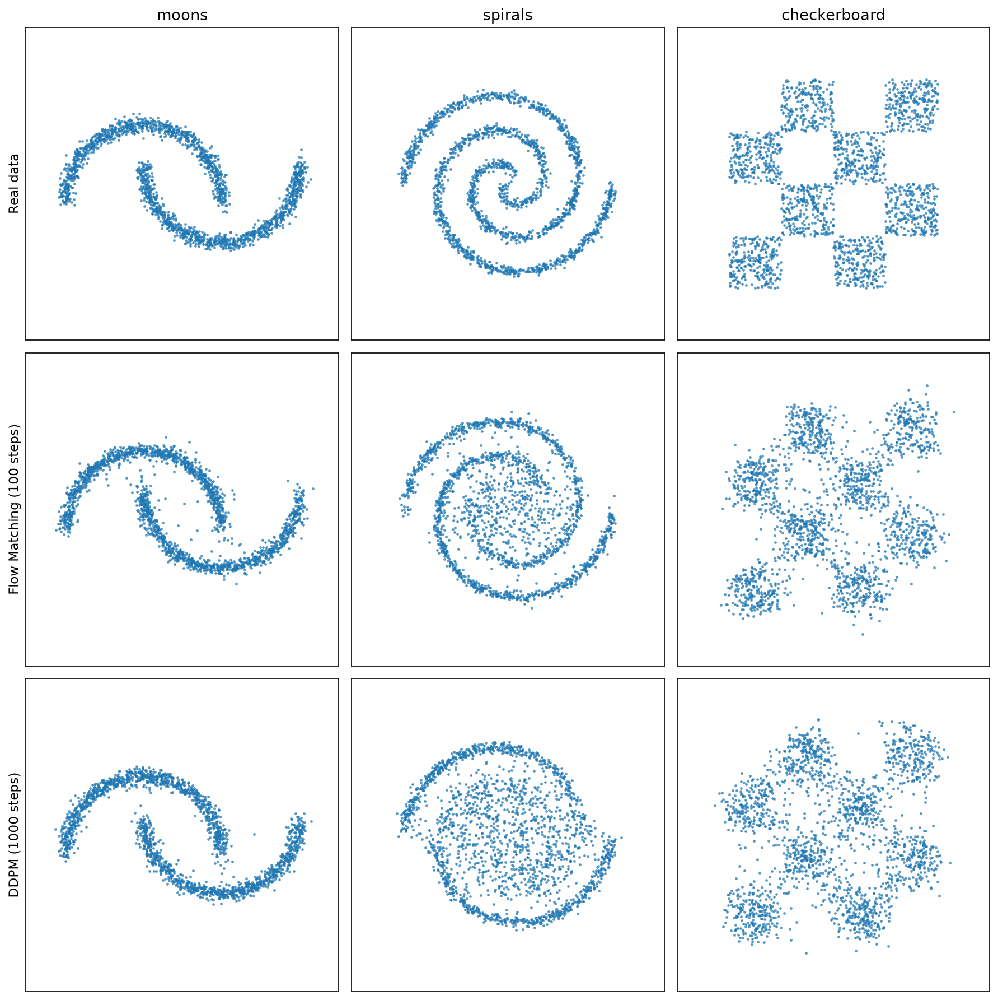
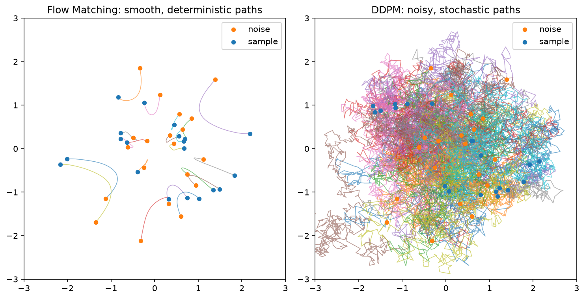
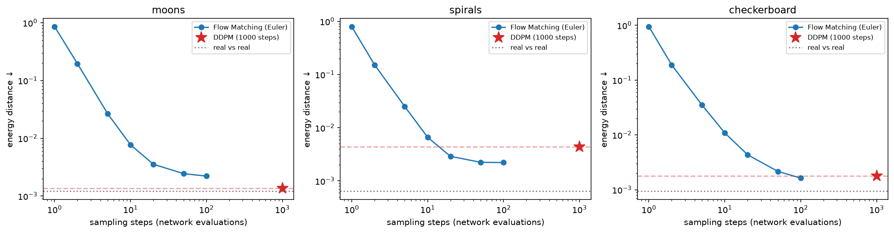

<p align="center">
  
</p>

<h1 align="center">Diffusion vs Flow Matching</h1>

<p align="center">
  <b>DDPM and Flow Matching implemented from scratch in PyTorch, compared side by side.</b>
</p>

> 🚧 Work in progress — see the [roadmap](#roadmap).

## TL;DR

With the same network and training budget, **Flow Matching reaches quality comparable to DDPM with ~50x fewer sampling steps**.
DDPM is slightly better on the simplest distribution (moons), while Flow Matching is clearly better on the hardest one (spirals).

## The two methods in one minute

### Flow Matching

Take a noise sample $x_0 \sim \mathcal{N}(0, I)$ and a data sample $x_1$, and join them with a straight line:

$$
x_t = (1 - t)\,x_0 + t\,x_1, \qquad t \in [0, 1]
$$

A neural network $v_\theta(x_t, t)$ learns to predict the velocity along that line, $x_1 - x_0$:

$$
\mathcal{L}_{\text{FM}} = \mathbb{E}\,\big\| (x_1 - x_0) - v_\theta(x_t, t) \big\|^2
$$

To generate new data, start from noise and follow the learned velocity from $t = 0$ to $t = 1$ (Euler method).

### DDPM

Gradually add Gaussian noise to the data over $T = 1000$ steps. Any noisy step can be computed in one shot:

$$
x_t = \sqrt{\bar\alpha_t}\,x_0 + \sqrt{1 - \bar\alpha_t}\,\varepsilon, \qquad \varepsilon \sim \mathcal{N}(0, I)
$$

A neural network $\varepsilon_\theta(x_t, t)$ learns to predict the noise that was added:

$$
\mathcal{L}_{\text{DDPM}} = \mathbb{E}\,\big\| \varepsilon - \varepsilon_\theta(x_t, t) \big\|^2
$$

To generate new data, start from pure noise and remove a bit of the predicted noise at each of the 1000 steps.

> ⚠️ **Time goes in opposite directions:** in Flow Matching $t = 0$ is noise and $t = 1$ is data; in DDPM $t = 0$ is data and $t = T$ is noise.



## Flow Matching results

### How many sampling steps are needed?



- **1 step**: all points collapse to the center. At $t = 0$ the input is pure noise, so the best the network can predict is the *average* velocity, which sends every point to the mean of the data.
- **20 steps**: already almost identical to 100.

### Trajectories from noise to data



The learned paths are smooth and nearly straight, which is why few steps are enough.

### Improving the network



Feeding time as a sinusoidal embedding (instead of a single number) lets the network
learn the outer turns of the spirals. The inner turns and the sharp checkerboard edges
still need a bigger network and longer training.

## DDPM vs Flow Matching

Both methods use **the same network, data, training steps, learning rate and seed** — only the method changes.

### Samples



### Trajectories (same starting noise)



Flow Matching moves each point along a short, smooth path. DDPM adds fresh noise at every step,
so its paths wander around before reaching the data.

### Quality vs. number of sampling steps



Quality is measured with the **energy distance** between 2000 generated and 2000 real points
(lower is better; the dotted line is real vs. real, the best achievable with this sample size).

| Dataset | DDPM (1000 steps) | Flow Matching (20 steps) | Flow Matching (100 steps) |
|---|---|---|---|
| Moons | **0.0014** | 0.0036 | 0.0022 |
| Spirals | 0.0043 | 0.0029 | **0.0022** |
| Checkerboard | 0.0018 | 0.0043 | **0.0016** |

| Method | Time for 2000 samples (CPU) | Speed-up vs DDPM |
|---|---|---|
| Flow Matching, 20 steps | 0.072 s | 42x |
| Flow Matching, 100 steps | 0.359 s | 8x |
| DDPM, 1000 steps | 3.027 s | 1x |

**Takeaway:** with the same network and training budget, Flow Matching reaches quality comparable
to DDPM with **~50x fewer sampling steps**. DDPM is slightly better on the simplest distribution
(moons), while Flow Matching is clearly better on the hardest one (spirals).
These are single-seed results with a small network.

## Quickstart

```bash
git clone https://github.com/carlosordonezz/diffusion-vs-flow-matching.git
cd diffusion-vs-flow-matching
uv sync
```

Then open the notebooks in `notebooks/` in order:

| Notebook | Content |
|---|---|
| `01_data.ipynb` | Two-moons dataset and time-conditioned MLP |
| `02_flow_matching.ipynb` | Flow Matching training, sampling, steps comparison and GIF |
| `03_toy_datasets.ipynb` | Spirals and checkerboard, and the improved network |
| `04_ddpm.ipynb` | DDPM noise schedule, training and sampling |
| `05_comparison.ipynb` | Fair DDPM vs Flow Matching comparison, metrics and timings |

## Project structure

```
src/dvfm/
├── data.py           # 2D toy datasets: moons, spirals, checkerboard
├── models.py         # time-conditioned MLPs (plain and with sinusoidal time embedding)
├── flow_matching.py  # Flow Matching loss and Euler sampler
├── ddpm.py           # DDPM noise schedule, loss and ancestral sampler
├── train.py          # generic training loop
└── metrics.py        # energy distance
notebooks/            # step-by-step experiments
assets/               # figures and GIFs used in this README
```

## Roadmap

- [x] Two-moons dataset
- [x] Flow Matching: loss, training and Euler sampler
- [x] Sampling steps comparison and trajectory GIF
- [x] Spirals and checkerboard datasets
- [x] Better network (sinusoidal time embedding) — spirals improved, needs more capacity/GPU for the inner turns
- [x] DDPM from scratch
- [x] DDPM vs Flow Matching comparison on 2D data
- [ ] Repeat the comparison with several seeds (error bars)
- [ ] DDIM sampler (DDPM with fewer steps)
- [ ] U-Net on MNIST / Fashion-MNIST
- [ ] FID vs number of steps on images
- [ ] Tests and CI

## References

- Lipman et al. *Flow Matching for Generative Modeling.* ICLR 2023. [arXiv:2210.02747](https://arxiv.org/abs/2210.02747)
- Liu et al. *Flow Straight and Fast: Learning to Generate and Transfer Data with Rectified Flow.* ICLR 2023. [arXiv:2209.03003](https://arxiv.org/abs/2209.03003)
- Ho et al. *Denoising Diffusion Probabilistic Models.* NeurIPS 2020. [arXiv:2006.11239](https://arxiv.org/abs/2006.11239)
- Song et al. *Denoising Diffusion Implicit Models.* ICLR 2021. [arXiv:2010.02502](https://arxiv.org/abs/2010.02502)
- Székely & Rizzo. *Energy statistics: A class of statistics based on distances.* Journal of Statistical Planning and Inference, 2013.

## License

[MIT](LICENSE)